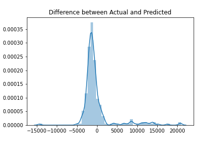
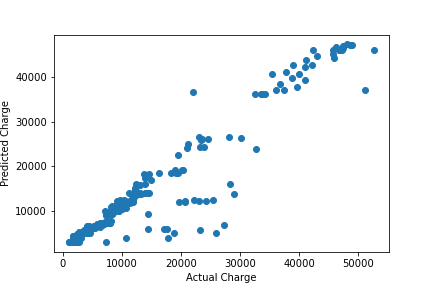

# Health-Insurance-Charge-Predictor :man_health_worker:

### Link to notebook: https://nbviewer.jupyter.org/github/AnuragMishra2311/Health-Insurance-Charge-Predictor/blob/master/Model.ipynb

## Data Desription
| Columns | Description | 
| :---: |:--- |  
|Age |Age of primary beneficiary |
|Sex| Gender of beneficary|
|BMI| Body Mass Index of beneficary|
|Children|Number of Children covered by health Insurance|
|Smoker | Smoking |
|Region | Residential Area of beneficary |
|Charges | Cost of Insurance|

## Score of different Models
| Model | Cross Val Score |
| :---:  | :---:  |
| Linear Regression |  0.72 |
| Ridge Regression |   0.72 |
| Lasso Regression |   0.72 |
| Polynomial Regression| 0.82|
| **Random Forest** | **0.84**|
|Decision Tree| 0.66|
| XGBoost | 0.82|

Random Forest is the best fit for the model.

 
